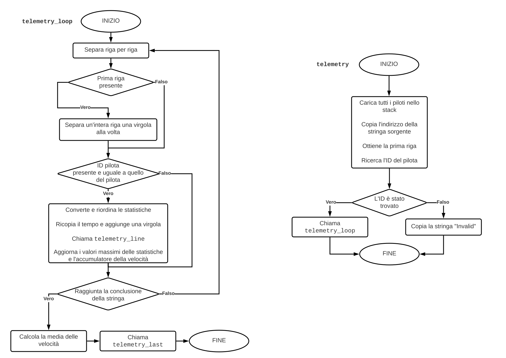
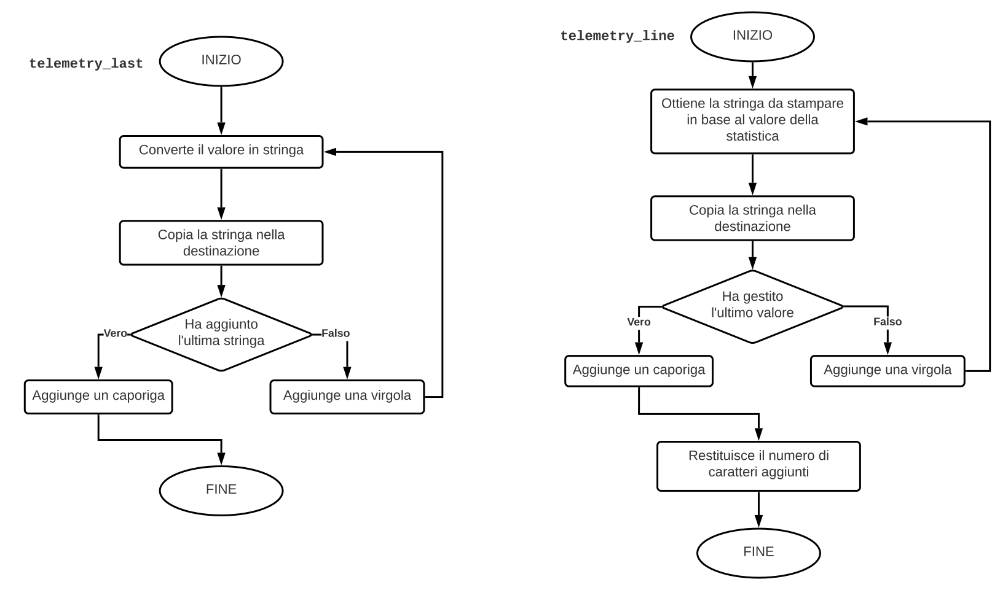

# Sistema di telemetria F1

Abbiamo sviluppato un programma in linguaggio Assembly `x86` con sintassi AT&T, che simula il sistema di telemetria del videogame F1.

## Traccia

Il sistema legge un file la cui prima riga è il nome di un pilota, mentre le successive sono precedute dall'istante di tempo e dall'identificatore del pilota a cui sono associate e contengono:

- giri al minuto del motore
- temperatura del motore
- velocità istantanea del veicolo.

Tutte queste informazioni sono nel formato:

> ```
> istante, identif., velocità, giri, temperatura
> ```

Se il pilota viene riconosciuto, dopo aver letto, interpretato ed elaborato le informazioni, il sistema produce un file in cui tutte le informazioni riguardano esclusivamente lui, altrimenti scrive `"Invalid"` all'interno dello stesso e termina.

Il riconoscimento avviene cercando il nome all'interno di un contenitore, se viene trovato ne viene utilizzato l'identificatore per interpretare le righe sottostanti.

Tutte le righe prodotte seguono il formato:

> ```csv
> istante, liv. giri, liv. temperatura, liv. velocità
> ```

Tranne l'ultima che contiene i valori massimi di queste statistiche e in più la media (intera) della velocità istantanea, più precisamente:

> ```
> max. giri, max. temperatura, max. velocità, med. velocità
> ```

I livelli che possono assumere le varie informazioni sono riportati nella tabella:

| **Parametro**     | `LOW`       | `MEDIUM`             | `HIGH`    |
| :---------------: | :---------: | :------------------: | :-------: |
| **Giri motore**   | $x \le 500$ | $5000 < x \le 10000$ | $x > 110$ |
| **Temperatura**   | $x \le 90$  | $90 < x \le 110$     | $x > 110$ |
| **Velocità**      | $x \le 110$ | $100 < x \le 250$    | $x > 250$ |

## Variabili

Per riuscire a realizzare il sistema abbiamo usufruito di quattro variabili:

1. un array contenente i nomi dei piloti
2. un array contenente le stringhe `"LOW"`, `"MEDIUM"`, `"HIGH"`
3. un array contenente le soglie tra i livelli
4. una stringa per scrivere `"Invalid"`.

L'array contenente i nomi dei piloti viene utilizzato nella funzione `telemetry` per capire se la prima riga del file è un pilota valido, mentre quelli contenenti le stringhe e le soglie vengono utilizzate nella funzione `telemetry_line` per stampare la giusta stringa in base al valore della statistica.

Questi array non sono altro che targhette salvate staticamente nel codice che poi vengono caricate una dopo l'altra contiguamente nello stack. Ad esempio per caricare le stringhe dei livelli abbiamo scritto:

> ```s
> /* Carica la stringa "HIGH". */
> leal level_02_str, %esi         # Carica l'indirizzo in %esi.
> movl %esi, -4(%ebp)             # e lo copia nello stack.
>
> /* Ripete la stessa operazione con "MEDIUM" e "LOW". */
> leal level_01_str, %esi
> movl %esi, -8(%ebp)
> leal level_00_str, %esi
> movl %esi, -12(%ebp)
> ```

Mentre per l'array delle soglie, essendo costituito da interi, non abbiamo utilizzato l'istruzione `leal` ma `movl`. Infine, la stringa `"Invalid"` viene usata anch'essa in `telemetry` nel caso in cui il pilota non sia stato riconosciuto.

## Funzioni

### Passaggio dei parametri

Prima di tutto, durante la chiamata di una funzione esistono due protagonisti, il **chiamante** ed il **chiamato**, che hanno responsabilità diverse.

Più precisamente, nello standard di chiamata C, il *chiamante* deve:

1. Eventualmente salvare i registri `%eax`, `%edx` ed `%ecx`

2. Caricare nello stack dall'ultimo al primo i vari parametri

3. Chiamare la funzione stessa

4. Recuperare il risultato dal registro `%eax` se necessario.

Viceversa, il *chiamato* ha il compito di:

1. Salvare il registro `%ebp` nello stack

2. Allocare eventuale spazio nello stack per le variabili

3. Salvare i registri `%ebx`, `%esi`, `%edi` se vengono utilizzati

4. Eseguire tutte le operazioni utili a produrre il risultato

5. Recuperare i registri se precedentemente salvati

6. Liberare lo spazio se precedentemente allocato

7. Recuperare il valore iniziale di `%ebp` dallo stack

8. Ritornare al chiamante.

### Funzioni di supporto

Per riuscire a implementare il sistema nel modo più comprensibile e ordinato possibile, abbiamo implementato delle funzioni di supporto come ad esempio le `strncmp` e `strncpy` della libreria standard C con alcune modifiche.

#### Lunghezza di una stringa

> ```c
> unsigned int
> strlen(const char *str);
> ```

Calcola la lunghezza di una stringa escludendo il carattere terminatore.

#### Confronto tra stringhe

> ```c
> int
> strncmp(const char *str1, const char *str2, unsigned int num);
> ```

Confronta un certo numero di caratteri di due stringhe.

#### Ribaltamento di una stringa

> ```c
> char *
> strnrev(char *str, unsigned int num);
> ```

Scambia un certo numero di caratteri di una stringa.

#### Copia di una stringa

> ```c
> int
> strncpy(char *dst, const char *src, unsigned int num);
> ```

Copia un certo numero di caratteri da una stringa in un'altra.

Solamente se il numero di caratteri da copiare supera la lunghezza della stringa sorgente, allora viene copiato anche il terminatore.

#### Copia di una stringa

> ```c
> unsigned int
> strlcpy(char *dst, const char *src, unsigned int num);
> ```

Copia un certo numero di caratteri da una stringa in un'altra.

Indipendentemente dallo stato della stringa sorgente, quella di destinazione viene terminata sempre, al prezzo di un carattere copiato in meno.

#### Conversione da stringa ad intero

> ```c
> unsigned int
> strtoi(const char *str);
> ```

Converte una stringa in un intero di base 10.

#### Conversione da intero a stringa

> ```c
> char *
> itostr(unsigned int num, char *str);
> ```

Converte un intero di base 10 in una stringa.

#### Collocazione di un valore in un intervallo

> ```c
> unsigned int
> select(unsigned int val, unsigned int arr[], unsigned int len);
> ```

Verifica in quale intervallo si trova un determinato valore.

#### Separazione di una stringa

> ```c
> char*
> strsep(char **ptr, char sep);
> ```

Spezza una stringa sul posto in base ad un certo carattere separatore.

#### Separazione di una stringa

> ```c
> unsigned int
> strnsep(char *arr[], unsigned int num, char **ptr, char sep);
> ```

Spezza una stringa sul posto in base ad un certo carattere separatore più volte.

#### Ricerca di una stringa in un array

> ```c
> int
> arrfind(const char *arr[], unsigned int len, const char *key);
> ```

Cerca una particolare chiave all'interno di un array.

## Diagramma di flusso

{ width=95% }

{ width=95% }

## Scelte progettuali

Durante la progettazione abbiamo preso le seguenti decisioni:

1. Abbiamo suddiviso il sistema il più possibile usando più funzioni seguendo il pricipio *"divide et impera"*

2. Tutto il codice è stato prima preparato nel linguaggio C, e poi usato come linea guida per scrivere la versione Assembly.

3. Per essere sicuri che le funzioni Assembly fossero corrette le abbiamo provate tramite del codice C e dunque abbiamo seguito il suo standard di chiamata a funzione.
